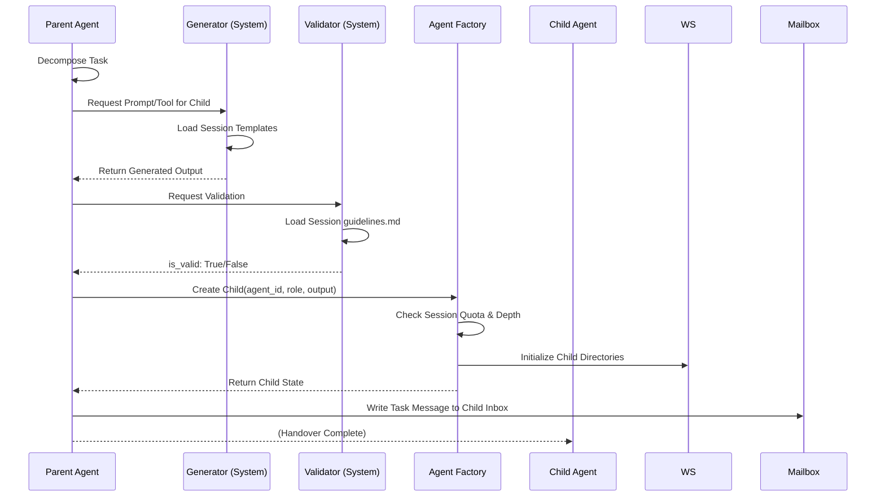

# Architecture

This document describes the design and implementation of the LangGraph-based multi-agent runtime.

## Core Tenets

The platform is built on the following architectural pillars:

1.  **Isolation-first [Y]:** Agents operate in strictly bounded filesystem and process contexts.
2.  **Immutable Execution Contexts [Y]:** Sessions are hydrated via copying (not symlinking) to ensure global upgrades do not disrupt active work.
3.  **Service-Oriented Multi-tenancy [Y]:** Native support for `user_id` and `session_id` throughout the stack.
4.  **Resource-bounded Autonomy [Y]:** Recursive spawning is governed by depth limits, session quotas, and loop detection.
5.  **State Persistence & Resumability [N]:** The ability to recover graph state from disk after process failure (Pending SQLiteSaver integration).

---

## 1. Hierarchical Workspace (`.pagent`)

The workspace root organizes data to support multi-tenancy, resource inheritance, and **Knowledge Persistence**.

### Directory Structure
-   `global/`: Shared system-wide prompts, skills, and guidelines.
-   `user_{user_id}/`: Persistent user profile and configuration.
-   `user_{user_id}/{session_id}/`: The atomic unit of execution.
    -   `guidelines.md`: Session-specific safety rules.
    -   `knowledge/`: **[NEW]** Extracted "Fact Sheets" (Markdown) from large-file analysis.
    -   `semantic_index/`: **[NEW]** Hybrid Sparse/LSH indices for local file search.
    -   `platform.log`: **[NEW]** Persistent session-level execution trace.
    -   `agents/{agent_id}/`: Individual agent sandbox.

---

## 2. Specialized System Agents

The platform coordinates a hierarchy of agents through standardized, dependency-injected interfaces.

### 🤖 Supervisor Agent
The primary orchestrator. Uses structured LLM output (`DecompositionResult`) to break down tasks and recursively spawn sub-agents (Supervisors or Workers).

### 🤖 Generator Agent
A generic code/prompt writer. Hydrated with different system prompts to generate either sub-agent instructions (`PROMPT`) or Python code for dynamic tools (`TOOL`).

### 🤖 Validator Agent
Ensures generated content adheres to `guidelines.md`. Uses structured LLM output (`ValidationResult`) to accept or reject generator output.

### 🤖 Search Agent
Manages local folder indexing and semantic querying using the `SemanticSearchEngine`. Supports **Chunked Indexing** for large file analysis.

### 🤖 FactSheet Agent
Extracts granular findings from file chunks into persistent Markdown "Fact Sheets" within the `knowledge/` directory.

---

## 3. Security & Safety Mechanisms

### Dual-Path Tool Dispatching
-   **Native (COMMUNITY):** Trusted tools run within the main process for performance.
-   **Sandboxed (DYNAMIC):** AI-written tools run via `ProcessSandboxRunner` with strict timeouts and process-level isolation.

### Role-Aware Loop Detection
-   **Node Frequency:** Tracks visits to graph nodes via reducers.
-   **Semantic Repetition:** Detects identical message cycles.
-   **Thresholds:** Supervisors have strict limits (e.g., 3 retries); Workers have higher limits (e.g., 10).

### Proxy & Connectivity
-   **Custom Endpoints:** Support for `OPENAI_BASE_URL` for local models or proxies.
-   **Redirect Detection:** Custom HTTP hook detects corporate captive portals and outputs the location link.

---

## 4. Interaction & Observability

### Rich UI
The CLI provides a live-updating `rich.tree` visualization of the orchestration hierarchy, showing the "Thinking" state and "Agent Tree" progress in real-time.

### Tiered Logging
-   **stdout:** Reserved for the Rich UI.
-   **stderr:** Human-readable functional trace for developers.
-   **file:** Full session trace persisted to `platform.log` for post-mortem analysis.

---

## 5. Current Gaps & Roadmap

| Feature | Status | Priority |
| :--- | :--- | :--- |
| **SQLite Checkpointing** | **N** | **High** - Required for true graph resumability. |
| **Scheduler/Listener** | **N** | **High** - Automated triggering of Mailbox messages. |
| **Formal Methods Validator** | **N** | Medium - SMT-based code verification. |
| **Branching Snapshots** | **N** | Low - Session rewinding and auditing. |

