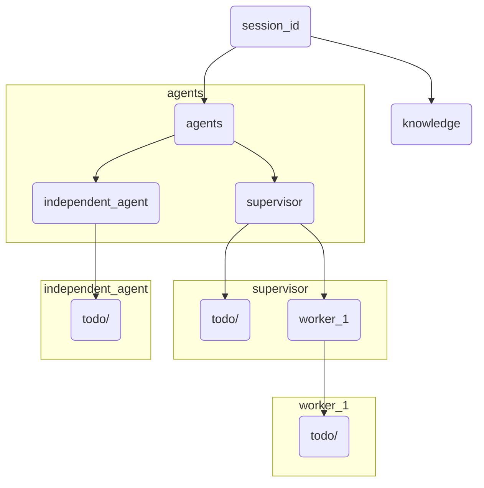
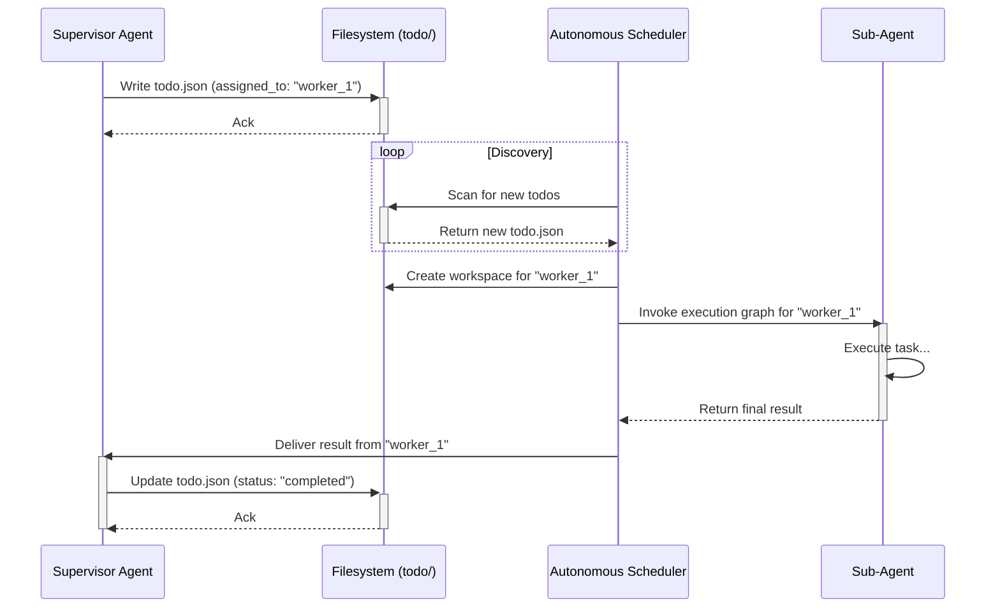

# Architecture

This document describes the design and implementation of the LangGraph-based multi-agent runtime.

## Core Tenets

The platform is built on the following architectural pillars:

1.  **Isolation-first [Y]:** Agents operate in strictly bounded filesystem and process contexts.
2.  **Immutable Execution Contexts [Y]:** Sessions are hydrated via copying (not symlinking) to ensure global upgrades do not disrupt active work.
3.  **Service-Oriented Multi-tenancy [Y]:** Native support for `user_id` and `session_id` throughout the stack.
4.  **Resource-bounded Autonomy [Y]:** Recursive spawning is governed by depth limits, session quotas, and loop detection.
5.  **State Persistence & Resumability [Y]:** The ability to recover graph state from disk after process failure via SQLiteSaver.
6.  **Recursive Hierarchical Units [Y]:** Unified graph execution with single `thread_id` and "Result-only" state merging.
7.  **Lexical Scoping [Y]:** Downward visibility of `global_context` folders (children see parent facts).
8.  **Structured Error Handling [Y]:** Standardized `ErrorCode` and `ErrorDetail` for LLM-driven error recovery.

---

## 1. Project Package Structure

The `runtime` package is organized into four domain-isolated sub-packages.

```text
src/agent_platform/runtime/
├── core/           # Low-level system primitives
│   ├── workspace.py        # Workspace hierarchy management
│   ├── sandbox.py          # Process-level isolation
│   ├── dispatcher.py       # Tool execution routing (State-aware)
│   ├── context_store.py    # [NEW] Hierarchical knowledge visibility
│   ├── mailbox.py          # Filesystem transport logic
│   ├── agent_factory.py    # Hierarchical agent initialization
│   └── tools/              # Native Core Tools
│       └── filesystem.py   # Secure ls, read, write
│
├── orch/           # LangGraph plumbing & State
│   ├── state.py            # Reducer-based AgentState with final_result
│   ├── quota.py            # Session usage models
│   ├── logic.py            # Loop and repetition monitor
│   ├── unit_compiler.py    # [NEW] Dynamic Supervisor/Worker graph compiler
│   └── result_hook.py      # [NEW] Big-data offloading logic
│
├── agents/         # System agent implementations
│   ├── supervisor.py       # Strategy-based Planning & Orchestration
│   ├── worker.py           # [NEW] LLM-driven tool execution
│   └── validator.py        # Output safety verification
│
├── storage/        # Persistence & Specialized Tools
│   ├── knowledge.py        # Markdown FactSheet management
│   ├── semantic_search.py  # Hybrid Sparse/LSH indexing engine
│   ├── search_tool.py      # [NEW] Semantic search tools
│   └── context_tool.py     # [NEW] Hierarchical context tools
```

---

## 2. Hierarchical Workspace (`.pagent`)

The workspace root organizes data to support multi-tenancy and lexical scoping.

### Directory Structure
-   `user_{user_id}/{session_id}/`: The atomic unit of execution.
    -   `guidelines.md`: Session-specific safety rules.
    -   `knowledge/`: Offloaded large results (Markdown).
    -   `agents/{parent_id}/{child_id}/`: Recursive agent sandboxes.
        -   `inbox/`, `outbox/`: Communication channels.
        -   `todo/`: Agent-specific task list.
        -   `global_context/`: Shared facts (Lexical scoping).
        -   `state.db`: LangGraph SQLite checkpointer.



---

## 3. Recursive Orchestration Model

The platform uses a **Recursive Unit** model where a single thread manages a tree of subgraphs. Delegation and task management are handled via a `todo.json` schema within each agent's `todo/` directory.

### The `todo.json` Schema

Each file in an agent's `todo/` directory represents a single task or delegation.

-   `description`: (string) A high-level description of the task or the goal for a delegated sub-agent.
-   `status`: (string) The current state of the task, e.g., `pending`, `in_progress`, `completed`.
-   `type`: (string) The nature of the task, typically `agent` for delegation or `tool` for tool execution.
-   `assigned_to`: (string | null) If `type` is `agent`, this field contains the unique ID (relative path) of the sub-agent responsible for the task. If null, the task is for the current agent.
-   `payload`: (object) If `type` is `tool`, this contains the tool name and arguments (e.g., `{"name": "read_file", "args": {"file_path": "..."}}`).

### The Flow

1.  **Planning:** The `Supervisor` agent decides to delegate a task. It writes a new `todo.json` file to its own `todo/` directory with `type: "agent"` and an `assigned_to` field pointing to a sub-agent's unique ID.
2.  **Discovery & Execution:** The `AutonomousScheduler` discovers this new `todo` item. It is responsible for initializing the sub-agent's workspace if it doesn't exist and triggering its execution graph.
3.  **Lexical Visibility:** Sub-agents recursively lookup `global_context` folders up to the session root to read shared facts.
4.  **Result Offloading:** Large outputs from tool calls are intercepted by the `ResultHook`, stored as files in the `knowledge/` directory, and the file reference is returned in the result.
5.  **Completion:** When a sub-agent completes its entire goal, its parent agent is responsible for updating the original `todo.json`'s status to `completed`.



---

## 4. Current Gaps & Roadmap

| Feature | Status | Priority |
| :--- | :--- | :--- |
| **Branching Snapshots** | **N** | High - Session rewinding and auditing. |
| **Formal Methods Validator** | **N** | Medium - SMT-based code verification. |
| **Autonomous Tool Generator**| **P** | Medium - Refinement of LLM tool-writing logic. |
